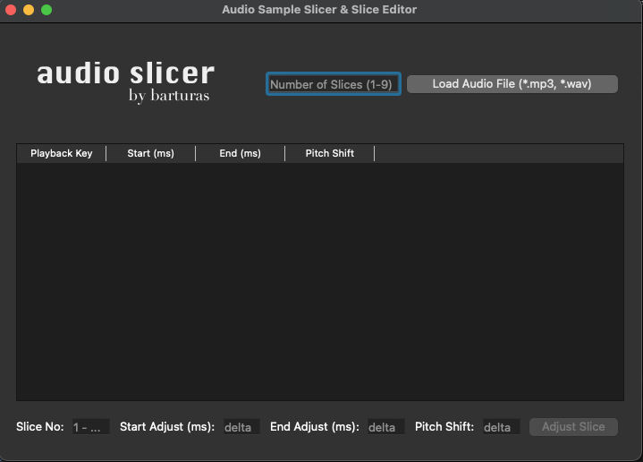
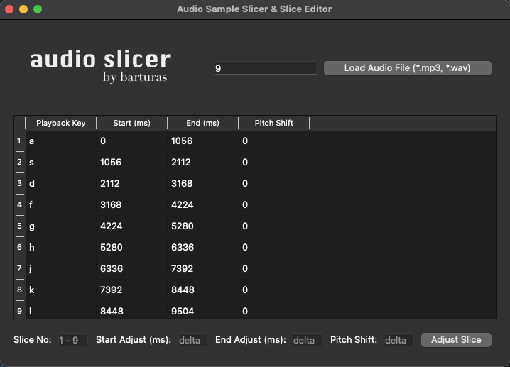

# Audio Slice Editor

Audio Slice Editor is a simple Python application that allows you to load and edit audio samples by creating and adjusting slices. You can modify the start time, end time, and pitch shift of each slice to create custom audio arrangements.

## Installation

1. Clone the repository:

   ```bash
   git clone https://github.com/yourusername/your-repo.git
   ```

2. Navigate to the project directory:

   ```bash
   cd your-repo
   ```

3. Create and activate a virtual environment:

   ```bash
   python -m venv your-venv
   source your-venv/bin/activate
   ```

4. Install the required dependencies within the virtual environment:

   ```bash
   pip install -r requirements.txt
   ```

   This will ensure that the project dependencies are isolated within the virtual environment.

## Usage

1. Run the application:

   ```bash
   python main.py
   ```

2. Create slices by specifying the number of slices and clicking the "Load Audio File" button (.mp3 and .wav only).

3. Adjust slices by selecting a slice number and modifying the start time, end time, and pitch shift.

4. Click the "Adjust Slice" button to apply the changes to the selected slice.

5. Repeat steps 4-5 for other slices as needed.

6. Use respective keyboard keys to play slices and experiment with various combinations.


## Screenshots





## Contributing

Contributions are welcome! If you'd like to contribute to this project, please follow these steps:

Fork the repository.
Create a new branch for your feature or bug fix.
Make your changes and commit them.
Push your changes to your fork.
Create a pull request.

## License

This project is licensed under the MIT License - see the [LICENSE](LICENSE) file for details.

## Acknowledgments

- PyQt5: https://www.riverbankcomputing.com/software/pyqt/
- PyDub: https://github.com/jiaaro/pydub
- PyGame: https://pypi.org/project/pygame/

## Documentation

[Detailed Documentation](https://slicer.barturas.lt)
